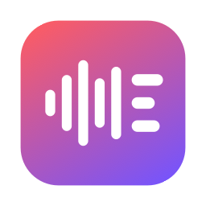
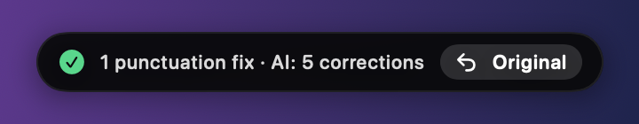
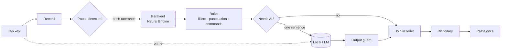

<div align="center">



# Saywrite

**Tap a key. Speak. Your text is already there.**

Local, instant AI dictation for macOS that only lets AI touch your words when they actually need it.

**100% free. Open source. No account, no subscription, no cloud.**

[](LICENSE)


</div>

---

## Why Saywrite

Most dictation apps run every sentence you say through a language model. That is slow, and it rewrites text that was fine to begin with. Saywrite flips that around:

- 💸 **Completely free.** No trial, no paywall, no "pro" tier, no account. Everything runs on your Mac, so there is nothing to pay for.
- ⚡ **Text before you blink.** Saywrite transcribes and cleans up *while you are still talking*. When you tap the key to stop, the work is basically done: typically **about a quarter of a second from stop to text**, including AI corrections.
- 🎯 **AI only where it is needed.** Every dictation gets instant, deterministic cleanup: filler words, stutters, capitalization, punctuation and spoken commands. The language model only sees the **sentence** that needs it (plus the one before, when you correct yourself across a pause). Everything else stays exactly as you said it.
- 👀 **You always know what changed.** After every dictation the pill shows a summary like `2 filler words · AI: 1 correction`, and one click on **↩ Original** swaps in the version without AI.
- 🔒 **Private by design.** Speech recognition runs on the Apple Neural Engine and the language model is built in and runs on your Mac with llama.cpp (no Ollama needed). Nothing leaves your Mac and there is no telemetry; the only network traffic is the one-time download of the speech model and, when you click Download, of the language model. If you choose Ollama as the engine and point Saywrite at a server elsewhere, the settings warn you that your dictations go there.
- 🪶 **Light on memory.** Built for an 8 GB MacBook. The speech model lives on the Neural Engine, and the LLM is loaded when you start dictating and released after 15 idle minutes.
- 🌍 **English and German**, with automatic language detection. The speech model understands 25 European languages.

<div align="center">

</div>

## Features

| | |
|---|---|
| **Tap or hold** | Tap right ⌥ to start, tap again to insert. Or hold it and release. **Esc** cancels. A soft sound marks start and stop. |
| **Out of the way** | While you speak, a small pill at the bottom of the screen shows only the stop button and your level. The words appear where they are inserted, not in a preview. |
| **Self-corrections** | "I'll be there at 5, no, at 6" → *I'll be there at 6.* "We could order pizza. Actually, scratch that, let's cook." → *Let's cook.* This also works across a pause. |
| **Rewrite by voice** | Select text, tap right ⌘ and say "more formal", "shorter" or "in German". |
| **Style per app** | Casual in Messages, WhatsApp and Slack (no period after a single sentence), formal in Mail and Word ("gonna" → "going to"), neutral everywhere else. Fully configurable. |
| **Dictionary** | Names and terms are always written your way ("git hub" → "GitHub"). Applied as a rule, never guessed. |
| **Spoken commands** | comma, question mark, exclamation mark, colon, semicolon, open/close quote, open/close paren, new line, new paragraph. The German equivalents work too. |
| **Knows what to leave alone** | "The comma is missing", "a new line of credit", "I think that that is right", e-mail addresses, URLs and abbreviations like "e.g." stay exactly as spoken. |
| **Safe AI** | A guard rejects model output that answers your question instead of transcribing it, invents text, or loses a number you corrected to. You then get the rule-cleaned version. Rewrites are checked too: a chat preamble is stripped, and an essay or an echoed instruction leaves your text unchanged. If the model times out once, the rest of that dictation goes without AI instead of waiting again for every sentence. |
| **Never loses a word** | If the model is missing, still loading or slow, the rules-only text is inserted. If you switch to another app while the text is being prepared, it is copied instead of landing in the wrong window. "Nothing heard" and a silent microphone are reported, and your recent dictations are kept in the history (readable by your user only). Password fields are detected: nothing is recorded or inserted there, and that dictation is not saved. Where an app hides its password field from Accessibility (some browsers, terminals), secure input is the only hint: the dictation is then kept off the AI server, not saved to the history and copied for ⌘V instead of pasted (it stays on the clipboard until you copy something else). The history lives on disk for 30 days at most and can be turned off in Settings; rewrites (selected text plus result) are never stored. |
| **Your microphone** | Pick any input device. Switching to AirPods mid-dictation is handled. |
| **Hands-free safety** | A forgotten recording stops by itself after 60 s of silence. |

## Speed and accuracy

Measured with the real models, on a MacBook with 8 GB RAM.

**Latency** (`scripts/bench.sh`, time from the end of speech to finished text; the app records 0.15 s longer so the last syllable is never cut off):

| Dictation | Rules only | With AI self-correction |
|---|---|---|
| Short sentence (1.6 s) | 0.10 s | – |
| Two sentences with a correction (8 s) | – | 0.24 s |
| Four sentences with pauses (17 s) | 0.09–0.13 s | – |

**Text quality** (`make eval` runs both sets, realistic recognizer output typed into the eval sets and run through the full pipeline with the local LLM; the speech model itself is not part of this measurement):

| Test set | Cases | Exactly right |
|---|---|---|
| English | 135 | ~95 % |
| German | 124 | ~91 % |

The sets cover everyday messages, e-mails, self-corrections of many shapes, sentences that must not change, numbers, dates, URLs, math, spoken commands and all three styles.

Take these numbers as a development benchmark, not an independent result: the rules and prompts were tuned while these sets were written, so they flatter the pipeline. For an honest number, add cases from real dictations to a separate file (for example `Tests/Eval/holdout.json`) and never adjust rules against it. `--report Tests/Eval/results.jsonl` appends each run (date, set, model, result) so changes show up over time.

## How it works



1. **Tapping the key** starts recording, and as soon as it is clear you are dictating (not typing a ⌥ shortcut), the language model is primed in the background, so there is no cold start later.
2. **A voice-activity detector** (Silero) cuts your speech at natural pauses. **Parakeet Ultra** transcribes each piece on the Neural Engine right away, while you keep talking.
3. **The language is detected** from the recognized words (English or German), and **deterministic rules** for that language clean every piece instantly.
4. **A gate** decides per sentence whether the model is needed at all. Most sentences never reach it.
5. **An output guard** checks what the model returns: mostly your own words, a plausible length, and the corrected values still present. Anything else is thrown away.
6. **The text is joined and pasted once**, so your cursor doesn't jump around, and your clipboard is restored afterwards (except for very large or lazily provided clipboard contents, which then stay replaced by the dictation). Without a text field in front, or when another app came to the front meanwhile, the text is copied instead.

## Install

**Requirements:** macOS 14+ on Apple Silicon.

### Download (no Xcode needed)

1. Download `Saywrite-vX.Y.Z.zip` from the [latest release](https://github.com/ursalfas11/saywrite/releases/latest) and unzip it.
2. Move `Saywrite.app` to `/Applications`.
3. Open it. Saywrite is signed ad hoc, not notarized by Apple, so macOS blocks the first launch. Either right-click the app → **Open** → **Open**, or run once:

   ```bash
   xattr -dr com.apple.quarantine /Applications/Saywrite.app
   ```

Each release lists the SHA-256 of the zip next to it.

**Signing trade-off.** The app is signed ad hoc with a requirement on the bundle identifier (`dev.saywrite.app`) only, so macOS keeps the Accessibility and Microphone permissions when you update or rebuild. The flip side: macOS trusts any binary that carries that identifier, so other code running as your user could sign itself the same way and inherit those permissions. Closing this needs a Developer ID certificate (team-bound requirement, hardened runtime, notarization), which is on the roadmap. Until then, install Saywrite only from this repository's releases or your own build, and verify the SHA-256.

### Build from source

Needs Xcode 16+ (the Command Line Tools alone cannot build the SwiftUI app).

```bash
git clone https://github.com/ursalfas11/saywrite.git
cd saywrite
make install                    # builds and copies Saywrite.app to /Applications
open /Applications/Saywrite.app
```

### The AI model

Saywrite has a language model built in (llama.cpp, running on the GPU of your Mac), so it no longer needs Ollama. It is not part of the download. On first launch the **Setup** tab of the settings shows the row **AI (built-in)** with the model's size (about 1.9 GB) and its licence. Click **Download**: Saywrite fetches the file once from Hugging Face into `~/Library/Application Support/Saywrite/Models/`, shows the progress, can pause and resume it, and checks the SHA-256 once the download is complete (a corrupted download is deleted; later launches only compare the file size). Nothing is downloaded until you click. The model is loaded when you start dictating and released after 15 idle minutes or when macOS is short on memory. To remove it, press **Delete model** in the settings, or delete that folder. The built-in model reads about 4000 tokens at once (roughly 10 000 characters of text including the answer); a longer selection for a rewrite is refused with "Selection too long for the built-in AI" and stays unchanged. Use the Ollama engine for such texts.

Without the model Saywrite still works with rule-based cleanup only.

> **Licence of the model: non-commercial use only.** The built-in model is [Qwen2.5-3B-Instruct](https://huggingface.co/Qwen/Qwen2.5-3B-Instruct) (Q4_K_M, [bartowski's GGUF build](https://huggingface.co/bartowski/Qwen2.5-3B-Instruct-GGUF)). It is released under the [Qwen Research License](https://huggingface.co/Qwen/Qwen2.5-3B-Instruct/blob/main/LICENSE), which allows research and evaluation use only; commercial use needs a licence from Alibaba Cloud. The MIT licence of Saywrite's code does not cover the model. The same applies to `qwen2.5:3b` from Ollama.

**Prefer Ollama?** In **General → Language & AI**, set **AI engine** to **Ollama**. Then Saywrite uses your Ollama server and its models (the rewrite model and the address are Ollama settings):

```bash
brew install ollama && brew services start ollama
ollama pull qwen2.5:3b
```

On first launch Saywrite also asks for **Microphone** and **Accessibility** access. Accessibility is needed for the global key and for pasting. The speech model (~600 MB) is then downloaded once.

## Usage

| Action | How |
|---|---|
| Dictate | Tap **right ⌥**, speak, tap again (or hold and release) |
| Stop | Tap again, or click the red button in the pill |
| Cancel | **Esc** |
| Undo the AI | Click **↩ Original** right after inserting (offered in text fields where undo is reliable) |
| Rewrite a selection | Select text, tap **right ⌘**, speak the instruction, tap again |
| Paste the last dictation | Menu bar icon → *Paste last dictation* |

Everything else is in the menu bar icon → **Settings**: keys, microphone, language, models, styles per app, dictionary and history. The interface, including the permission prompts, follows your system language (English or German).

## Configuration tips

- **Bigger model for rewriting:** with the Ollama engine, choose, for example, `qwen2.5:7b` under *Model (rewrite)* if you have the RAM (the built-in engine always uses its one bundled model). Dictation cleanup stays on the small, fast model.
- **Less AI in an app:** set that app to *Casual*, which uses AI only for explicit self-corrections, or switch AI off entirely in the menu.
- **Debugging:** `open --env SAYWRITE_DEBUG=1 --stderr /tmp/saywrite.log /Applications/Saywrite.app` logs hotkeys, pause detection and every model call, without your dictated text (only its length). Add `SAYWRITE_DEBUG_TEXT=1` to log the text as well; that log contains your dictations, so delete it when you are done.

## Development

```bash
make test                   # unit tests for the text pipeline
make eval                   # quality evaluation with the real local LLM (built-in model if downloaded, else Ollama) (German and English set)
make eval-rules             # rules-only eval against the thresholds in Tests/Eval/rules-baseline.txt (what CI runs)
swift run -c release SaywriteEval Tests/Eval/cases.json --backend ollama --model qwen2.5:7b --report Tests/Eval/results.jsonl
swift run -c release SaywriteEval Tests/Eval/cases.json --backend llama   # the built-in model (default when its file is downloaded)
swift run -c release SaywriteEval Tests/Eval/cases-en.json   # English set
make run                    # build the .app and launch it
scripts/bench.sh            # latency benchmark with the real models, no microphone needed
```

| Path | What lives there |
|---|---|
| `Sources/SaywriteCore` | Platform-independent logic: language detection, rules, gate, sentence splitter, dictionary, change summary, Ollama client, model download (resume and SHA-256), output guards, dictation session, the tap-or-hold hotkey logic and the paste-target rules. Fully unit-tested. |
| `Sources/SaywriteLlama` | The built-in model: a process-wide engine around the llama.cpp XCFramework (pinned release and checksum in `Package.swift`), loaded on first use and unloaded when idle. Kept out of SaywriteCore so the core and its tests do not need the binary framework. |
| `Sources/Saywrite` | The macOS app: event tap, audio capture, VAD segmentation, Parakeet, text insertion (Accessibility queries run off the main thread, which also serves the event tap), recorder pill, sounds, settings. Not unit-tested; CI builds it. |
| `Sources/SaywriteEval` | The quality evaluation runner. Cases live in `Tests/Eval`. |
| `docs/superpowers/specs` | The design document and the decisions made while building it. |

Useful hidden flags:
- `Saywrite --selftest <wav> [casual|neutral|formal] [--no-ai] [--backend llama|ollama]` runs a recording through the full pipeline.
- `Saywrite --render-overlay <dir>` renders the pill states to PNG (the images in `docs/images`).

## Roadmap

- Signed and notarized release builds with auto-update
- Matching the spacing and capitalization of the text around the cursor
- Numbered lists and e-mail addresses by voice
- Learning dictionary entries from your corrections

Contributions are welcome, especially new eval cases for more languages. Please open an issue first for bigger changes.

## Credits and license

Saywrite's code is **MIT licensed**, see [LICENSE](LICENSE). You can use, change and share it for free, including commercially. The downloadable language model is a separate work with its own licence (see **The AI model** above: non-commercial use only). Saywrite was written from scratch and builds on these open projects:

- [FluidAudio](https://github.com/FluidInference/FluidAudio) (Apache 2.0): Core ML speech recognition and voice-activity detection
- [Parakeet](https://huggingface.co/nvidia/parakeet-tdt-0.6b-v3) and [Parakeet Ultra](https://huggingface.co/moondream/parakeet-ultra) (CC BY 4.0): the speech model
- [Silero VAD](https://github.com/snakers4/silero-vad) (MIT)
- [llama.cpp](https://github.com/ggml-org/llama.cpp) (MIT): runs the built-in language model
- [Qwen2.5-3B-Instruct](https://huggingface.co/Qwen/Qwen2.5-3B-Instruct) ([Qwen Research License](https://huggingface.co/Qwen/Qwen2.5-3B-Instruct/blob/main/LICENSE), non-commercial use only): the language model, downloaded on first use
- [Ollama](https://ollama.com) (MIT): optional alternative engine

The full notices are in [THIRD_PARTY_LICENSES](THIRD_PARTY_LICENSES).
